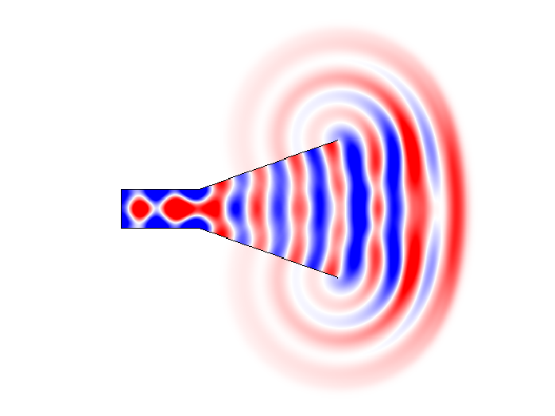
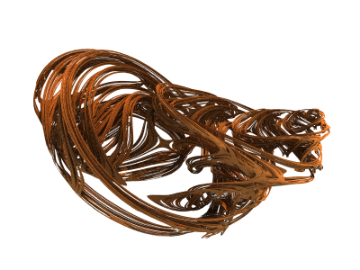

University of Colorado Boulder

Hello! I'm an undergraduate studying electrical engineering and applied mathematics at the [University of Colorado Boulder](https://www.colorado.edu). My general interests lie in applied electromagnetics, particularly in radio frequency systems and antennas.

I'm currently with the [Antenna Research Group](https://www.colorado.edu/lab/antenna/) at CU, where I'm working on developing electrically small antennas (ESAs) for HF communication applications. I previously worked in the High Speed Digital Engineering Group at CU, where I performed work on high bandwidth conductive ink structures and developed custom instrumentation for isothermal I-V characterization.

In my free time, I enjoy taking [walks in the woods](/hiking.html). 

A copy of my resume is available [here](/resume.html). I can be reached at <a href="mailto: edward@wawrzynek.com">edward@wawrzynek.com</a>.

# Publications
1. <b>E. Wawrzynek</b>, S. Yen, and D. Filipovic, "Design of an Electrically Small Circularly Polarized Spherical Folded Helix Antenna", 2025 United States National Committee of URSI National Radio Science Meeting (USNC-URSI NRSM), Boulder, CO, USA 2025 (accepted).

# Projects

<a href="fdtd_wave.html">FDTD wave equation solver</a>

An interactive finite difference time domain solver for the 2d wave equation, demonstrating various wave phenomenology.

<a href="http://fractal.wawrzynek.com">Fractal Explorer</a>

Software for exploring, rendering, and animating fractals, including 2D iterated systems and 3D distance estimated systems.

