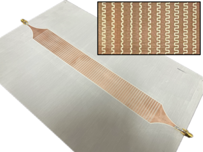
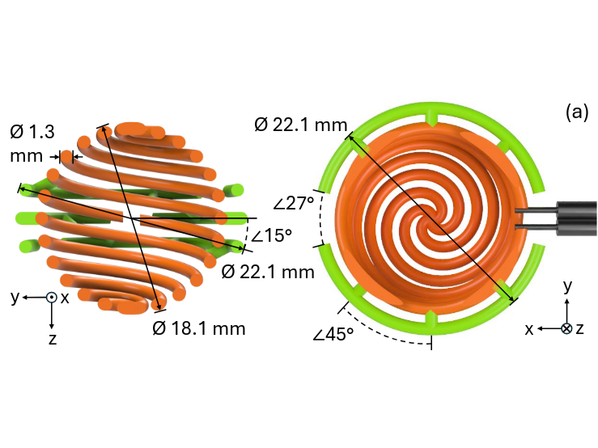

University of Colorado Boulder

Hello! I'm an undergraduate studying electrical engineering and applied mathematics at the [University of Colorado Boulder](https://www.colorado.edu). My general interests lie in applied electromagnetics, particularly in radio frequency systems and antennas.

I'm currently with the [Antenna Research Group](https://www.colorado.edu/lab/antenna/) at CU, where I'm working on developing electrically small antennas (ESAs), with a focus on small phased arrays for HF communication applications. I previously worked in the High Speed Digital Engineering Group at CU, where I performed work on high bandwidth conductive ink structures and developed custom instrumentation for isothermal I-V characterization.

In my free time, I enjoy taking [walks in the woods](/hiking.html). 

A copy of my resume is available [here](/resume.html). I can be reached at <a href="mailto: edward@wawrzynek.com">edward@wawrzynek.com</a>.

# Publications
1. <b>E. Wawrzynek</b>, S. Yen, L. Boskovic, and D. Filipovic, "An Electrically Small Circularly Polarized Spherical Folded Helix Antenna for GPS", <i>2025 IEEE International Symposium on Antennas and Propagation and USNC-URSI Radio Science Meeting (APS/URSI)</i>, Ottawa, Canada 2025.
2. <b>E. Wawrzynek</b>, S. Yen and D. Filipovic, "<a href="https://ieeexplore.ieee.org/abstract/document/10907254">Design of an Electrically Small Circularly Polarized Spherical Folded Helix Antenna</a>," <i>2025 United States National Committee of URSI National Radio Science Meeting (USNC-URSI NRSM)</i>, Boulder, CO, USA, 2025, pp. 352-353, doi: 10.23919/USNC-URSINRSM66067.2025.10907254.
3. S. Yen, <b>E. Wawrzynek</b>, and D. Filipovic, "On The Practicality of Superdirectivity in the HF Band," <i>2025 Antenna Applications Symposium,</i> Monticello, IL, USA, 2025 (accepted).

# Projects

<!-- header images should be 6 x 4.5 aspect ratio -->

<a href="leaky_wave.html">Leaky-Wave Antenna from Periodically Modulated Reactance Surface</a>

Design and fabrication of a frequency scanned leaky-wave antenna at X-band (10 GHz) from a composite right and left handed material (CRLH).

<a href="/papers/esa_helix_aps25.pdf">Electrically Small Spherical Folded Helix Antenna for GPS</a>

Design and fabrication of a small ($\lambda/12$ diameter) spherical helix antenna for GPS with low axial ratio.

<a href="fdtd_wave.html">FDTD wave equation solver</a>

An interactive finite difference time domain solver for the 2d wave equation, demonstrating various wave phenomenology.

<a href="http://fractal.wawrzynek.com">Fractal Explorer</a>

Software for exploring, rendering, and animating fractals, including 2D iterated systems and 3D distance estimated systems.

