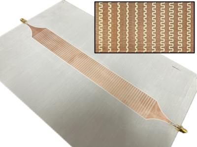
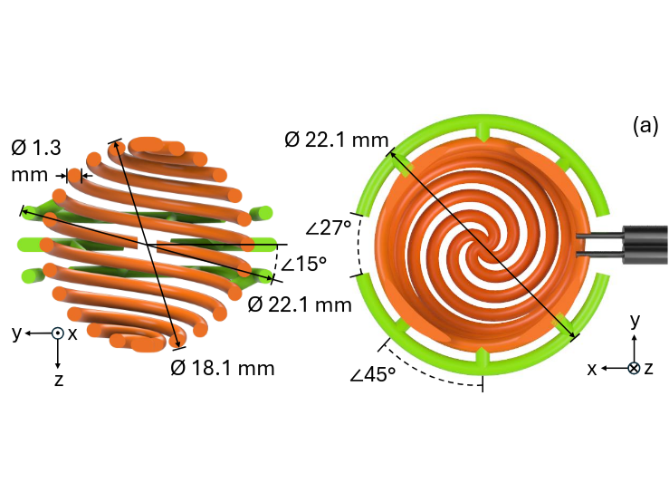
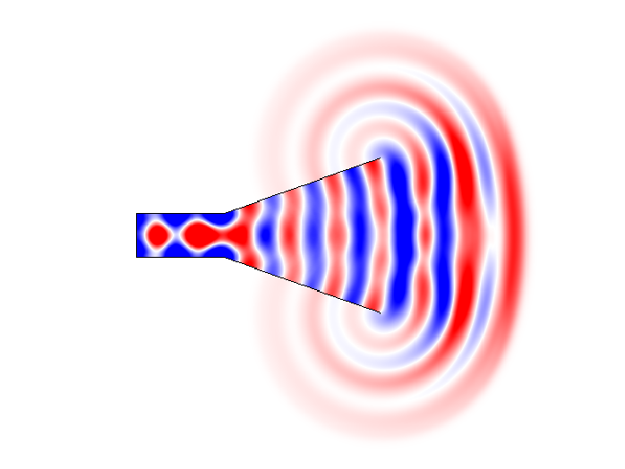
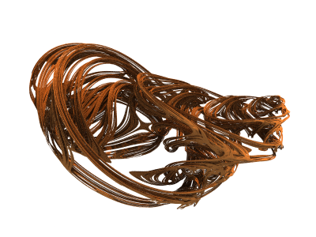

Hello! I'm a PhD student studying electrical engineering at the [University of Colorado Boulder](https://www.colorado.edu). My general interests lie in applied electromagnetics, particularly in antennas, lenses, and numerical electromagnetics.

I received B.S. degrees from CU in applied mathematics and electrical engineering. I'm currently with the [Antenna Research Group](https://www.colorado.edu/lab/antenna/) at CU, where I'm working on the design of lenses for near field manipulation of phased arrays. I previously worked on electrically small antennas, particularly for small arrays, as well as work in the High Speed Digital Engineering Group at CU on high bandwidth conductive ink structures.

In my free time, I enjoy taking [walks in the woods](/hiking.html). 

A copy of my resume is available [here](/resume.html). I can be reached at <a href="mailto: edward@wawrzynek.com">edward@wawrzynek.com</a>. 

# Publications
!include fragments/publications.md

# Projects
<!-- header images should be 6 x 4.5 aspect ratio -->

<a href="leaky_wave.html">Leaky-Wave Antenna from Periodically Modulated Reactance Surface</a>

Design and fabrication of a frequency scanned leaky-wave antenna at X-band (10 GHz) from a parallel plate waveguide with a sinusoidally modulated upper reactance surface.

<a href="/papers/esa_helix_aps25.pdf">Electrically Small Spherical Folded Helix Antenna for GPS</a>

Design and fabrication of a small ($\lambda/12$ diameter) spherical helix antenna for GPS with low axial ratio.

<a href="fdtd_wave.html">FDTD wave equation solver</a>

An interactive finite difference time domain solver for the 2d wave equation, demonstrating various wave phenomenology.

<a href="http://fractal.wawrzynek.com">Fractal Explorer</a>

Software for exploring, rendering, and animating fractals, including 2D iterated systems and 3D distance estimated systems.

